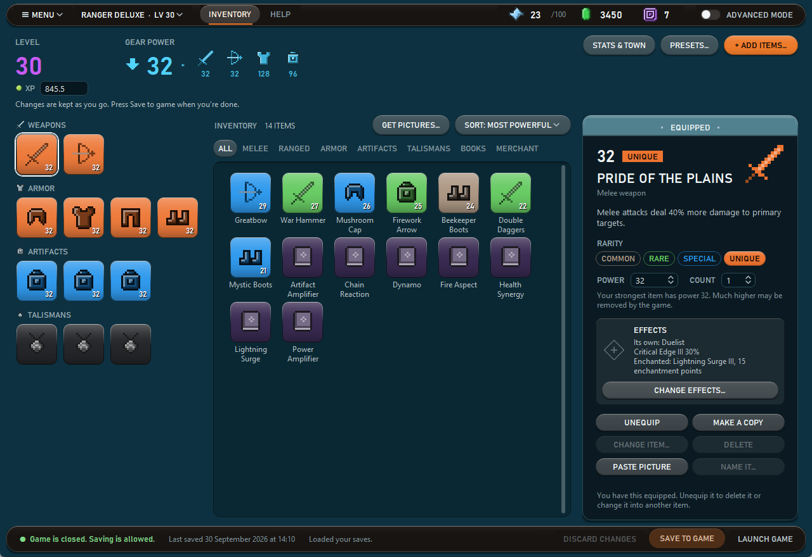
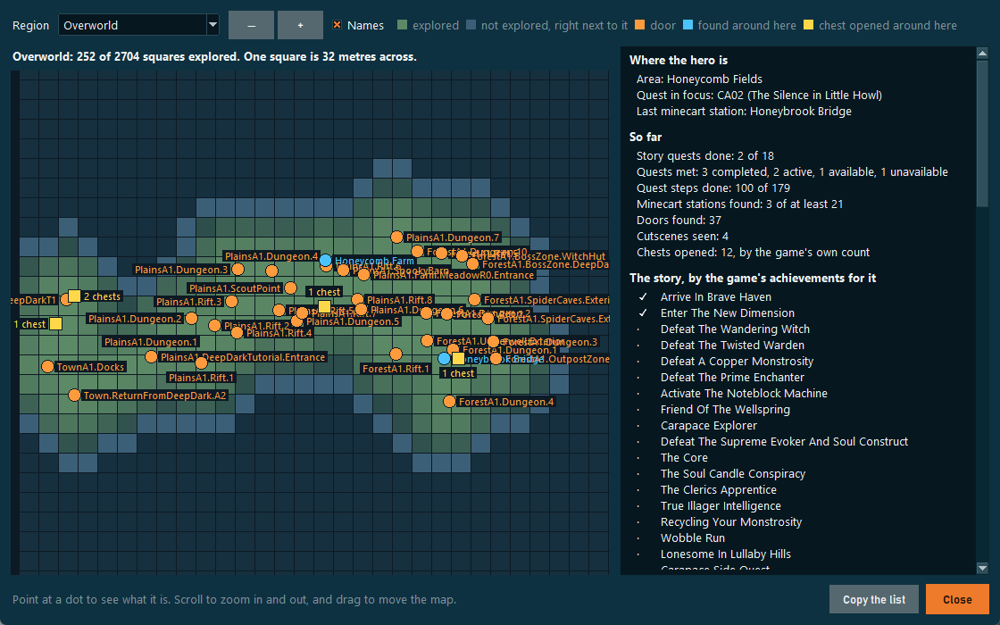
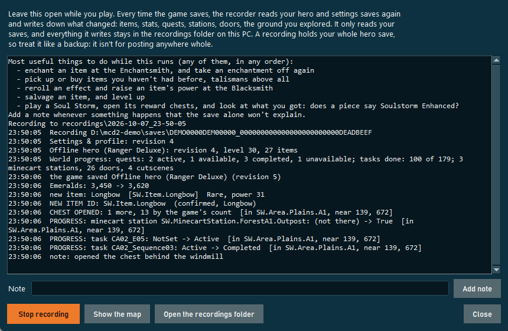

# Minecraft Dungeons II Save Editor

An unofficial save editor for **Minecraft Dungeons II** on PC: the **Xbox app / PC Game Pass** version and the
**Steam** version, on Windows, on Linux (Steam through Proton) and on a Mac (through CrossOver or Whisky). Change your offline hero's stats and gear, add and
equip items, and apply ready-made presets and complete kits from top builds, without having to know anything about
save files. It looks like the game's own inventory screen, so you already know your way around. Advanced mode shows
the full save for people who want it.


> **Also from the same developer:** [**Lemma**](https://lemma.ishiakiz.com), a free creative studio for Minecraft, and
> [**Batchly**](https://batch-ly.com), free browser games, tools and experiments.

**Questions, ideas and builds** go in [Discussions](https://github.com/IshiakiZ/mcd2-save-editor/discussions); bugs, and the
lists of item IDs the editor makes for you, in [Issues](https://github.com/IshiakiZ/mcd2-save-editor/issues).

## Features

- **Looks like the game:** your gear, your inventory and the item's card, laid out like the game's own inventory
  screen, in two looks: **Original** and **Liquid Glass**.
- **Stats:** emeralds, Echo Shards, level, XP, enchantment points, and the town's Merchant, Enchantsmith and
  Blacksmith levels.
- **Items:** add any of the game's 180 items and all 116 Uniques, with pictures and search. Change rarity, power
  and count, equip, copy or delete.
- **Effects and enchantments:** pick them yourself, or let **Best for** pick for damage, survival, mobility, loot,
  artifacts and souls, or companions. A piece can be made **Soulstorm Enhanced** too.
- **Talismans and enchantment books:** level a talisman up, and add any of the game's 32 books, so the Enchantsmith
  offers their enchantments.
- **Presets and kits:** most money, most XP, best loot, every minecart station, the most powerful gear, or one of
  six complete builds, in one click.
- **World map and play recorder:** see the ground your hero has explored and how far it has got, and write down
  what the game saves while you play.
- **Let an AI do it:** connect Claude or another AI assistant [over MCP](#let-an-ai-customise-your-hero-mcp) and
  ask for what you want.
- **Safe saving:** a backup before every save, one-click restore, and no saving while the game runs.
- **And more:** Simple and Advanced modes, sorting and filters, item pictures, a **Launch game** button, and an
  **Update** button when a newer version is out.

Every feature, in detail: **[Features](https://github.com/IshiakiZ/mcd2-save-editor/wiki/Features)** in the wiki.

| Add items | Kits |
|---|---|
|  |  |

| The Liquid Glass look (Menu → Look) | Advanced mode |
|---|---|
|  |  |

| The world map (Menu → World map…) | The play recorder (Menu → Play recorder…) |
|---|---|
|  |  |

## Download

**[⬇ Download MCD2SaveEditor.zip](https://github.com/IshiakiZ/mcd2-save-editor/releases/latest)** from the latest
release. There's nothing to install, and it finds your saves automatically.

1. Unzip it (right-click → **Extract All…**) and open the **MCD2SaveEditor** folder.
2. **Close the game.**
3. Open **MCD2SaveEditor.exe**. Leave it in its folder: it needs the `_internal` folder next to it.
4. Your hero opens (pick another at the top left), make your changes, and press **Save to game**.

Good to know:

- **"Windows protected your PC"?** The .exe isn't code-signed. Click **More info → Run anyway**.
- **Try a small change first** (a few emeralds, say) and check it in the game. Every save makes a backup first, and
  **Menu → Restore a backup…** puts one back.
- **Steam:** the editor finds your saves by itself, as it does the Xbox app's. On **Linux** and on a **Mac** it runs
  from its source: see [Linux and Mac](https://github.com/IshiakiZ/mcd2-save-editor/wiki/Linux-and-Mac).
- **Rather not run an .exe?**
  [Run it from source](https://github.com/IshiakiZ/mcd2-save-editor/wiki/Running-from-source) with Python 3.10 or
  newer.

More help: [Getting started](https://github.com/IshiakiZ/mcd2-save-editor/wiki/Getting-started) ·
[Troubleshooting](https://github.com/IshiakiZ/mcd2-save-editor/wiki/Troubleshooting)

### Antivirus warnings, and checking the download

Antivirus tools sometimes flag programs packaged the way this one is (with PyInstaller), and releases are not
code-signed. You don't have to take anyone's word for the download: GitHub Actions builds every release from this
repository's source, and `gh attestation verify MCD2SaveEditor.zip --repo IshiakiZ/mcd2-save-editor` confirms that
your zip is that build. The details are in
[Safety and privacy](https://github.com/IshiakiZ/mcd2-save-editor/wiki/Safety-and-privacy).

### Privacy

The editor never sends your saves, your hero's data or anything about you anywhere. It goes online for three things
only: when it opens, it asks GitHub whether a newer version is out; **Update** downloads that version; and it
downloads item pictures from minecraft.wiki when you ask.
[More](https://github.com/IshiakiZ/mcd2-save-editor/wiki/Safety-and-privacy#privacy).

## Let an AI customise your hero (MCP)

The editor can run as an [MCP](https://modelcontextprotocol.io) server, so AI assistants that support MCP (Claude
Desktop, Claude Code and others) can look at your heroes and change them for you. **Menu → Connect an AI (MCP)…** shows
the exact setup for your PC, with Copy buttons. In short:

- **Claude Desktop:** Settings → Developer → Edit Config, add this, save, and restart Claude Desktop:

  ```json
  {
    "mcpServers": {
      "mcd2-save-editor": { "command": "C:\\path\\to\\MCD2SaveEditor\\MCD2SaveEditor.exe", "args": ["mcp"] }
    }
  }
  ```

- **Claude Code:** `claude mcp add mcd2-save-editor -- "C:\path\to\MCD2SaveEditor\MCD2SaveEditor.exe" mcp`

The assistant gets tools to list your heroes, show a hero's stats, gear and inventory, search every item in the game,
set stats, add, change, equip, copy and delete items, add enchantment books, give an item effects and an
enchantment, set a talisman's level, and apply presets. Its changes collect in a draft, like unsaved
changes in the editor window: nothing is written until it calls **save_changes**, which needs the game to be closed
and backs up your saves first, exactly like **Save to game**. It plays by Simple mode's rules (offline heroes only, the
game's caps, slots that open with your level, and best-guess item IDs only if it asks for them), and it never sees
your sign-in, account or device data.

## What it can't do

- **Online heroes.** They're stored on the game's servers, so no save editor can change them. This editor works
  with **offline** heroes.
- **Anything it hasn't seen in a real save.** The game's own lists are in its encrypted files, which the editor
  doesn't break, so it learns how things are saved from players' saves. So far: all 180 items and 116 Uniques, all
  60 gear effects, all 32 enchantment books, and 24 of the 32 enchantments. An effect tier nobody has sent yet is
  marked as not seen, and the editor asks before adding it. **Share item IDs…** makes a list of what your saves
  add; nothing is sent unless you send it.
- **Still missing:** the names of five enchantment books, the other enchantments and some tiers, and levelling a
  companion's talisman outright (**Ready to level up** leaves it one XP short, and the game does the rest).
- **Story progress.** A preset adds minecart stations, and that is all the editor changes of it: quests and the
  map stay as the game saved them. The world map and the play recorder only show what's there, and can't see a
  chest or a secret you haven't touched.
- **Collections and achievements.** The editor leaves the game's own records alone, so a book added here counts
  for neither.
- **Very high power or level may be undone by the game.** Stay close to what the game gives at your level.
- **If you're asked which save to keep** after an edit, keep this PC's: that's the one with your changes.
- **Steam and Mac support are new,** and nobody has reported from a real Mac yet. Try a small change first.
- **Best for is a recommendation, not a measurement,** and item power caps come from community datamines.

The long version, with what's known and how:
**[Known limits](https://github.com/IshiakiZ/mcd2-save-editor/wiki/Known-limits)** in the wiki.

## How it works

**Steam version:** each save is its own file, `Character<id>.sav` for a hero, in the game's `SaveGames` folder
(`%LOCALAPPDATA%\Dungeons2\Saved\SaveGames` on Windows). The
content is the same plain JSON the Xbox build keeps in a blob, so the same codec reads it. The editor replaces the
file in one step (write a temporary file, then swap it in), and numbers the game writes in an unusual form are
written back exactly as they were, so an unedited save comes out byte for byte identical.

**Xbox app version:** the game stores saves in the Xbox app's standard layout under
`%LOCALAPPDATA%\Packages\Microsoft.MinecraftDungeons2_8wekyb3d8bbwe\SystemAppData\wgs\`: `containers.index`
lists named containers, each container folder has a `container.<N>` file naming its data blob, and the blobs hold
the data.

- **Heroes** (`Character<id>`) are plain, compact JSON. Stats are in `Ability.Attributes`, items in
  `Inventory.Entries`.
- An item's effects are saved in batches, one for each kind, in this order: the one a Unique comes with
  (`SW.Item.Effect.Static`), the ones the game rolled for it (`SW.Item.Effect.Rerollable`) and its enchantment
  (`SW.Item.Effect.Enchantment`); a talisman has its own instead (`SW.Item.Effect.Upgradable`). Each effect holds
  what it is (`SW.Effect.CriticalEdge`), its strength, and the template it was made from, which says the tier
  (`SW.EffectTemplate.CriticalEdge.II`, or `SW.EffectTemplate.Duelist.Unique` for the Pride of the Plains' own).
- **Settings** (`GlobalSaveDataDefault`) are JSON with every byte stored minus one (`{"blobs"` becomes `z!aknar!`).
- The editor writes both formats byte-for-byte the way the game does, so an unedited save comes out identical.
- Saves are written the way the game writes them: the new data gets a new file name, the revision goes up
  (`container.<N+1>`), and the container is marked modified so Gaming Services uploads it to the Xbox cloud. Only
  then is the old revision deleted.
- Sign-in, entitlement and device-ID containers are never read or changed.

## Command line

```
python -m dungeons2_editor list                                 # show containers
python -m dungeons2_editor export GlobalSaveDataDefault out.json
python -m dungeons2_editor import GlobalSaveDataDefault out.json # asks first, backs up first
python -m dungeons2_editor backup
python -m dungeons2_editor restore "backups\2026-09-30_14-35-12"
python -m dungeons2_editor verify                               # checks saves re-encode exactly; writes nothing
python -m dungeons2_editor pictures                             # download item pictures from minecraft.wiki
python -m dungeons2_editor items                                # every item the editor can add, with its ID
python -m dungeons2_editor ids                                  # item IDs in your saves the editor doesn't know yet
python -m dungeons2_editor record                               # the play recorder in a console (--atlas: write the map files)
python -m dungeons2_editor mcp                                  # run as an MCP server for an AI assistant (stdin/stdout)
python -m dungeons2_editor update                               # look for a newer version on GitHub and install it
python -m dungeons2_editor gui --look glass                     # open the window in Liquid Glass this once (classic: Original)
```

Add `--profile <folder>` to point at a save folder somewhere else (the Xbox folder with `containers.index`, or the
Steam `SaveGames` folder).

## Research: the fastest way to gear, XP and emeralds

[**mcd2-research**](mcd2-research/README.md) is a separate write-up of what the game's readable files and
community datamines say about loot odds, the route to level 42, secret talisman locations, currency caps, Soul
Storms and the fastest progression. The editor's presets are built from it.

## Development

```
python -m unittest discover -s tests -t .
```

The tests run on every push and pull request, on Windows, on Linux and on a Mac (`.github/workflows/tests.yml`).

| Path | What's in it |
|---|---|
| `dungeons2_editor/wgs.py` | Xbox save containers: reading, and writing new revisions |
| `dungeons2_editor/steam.py` | Steam saves (loose `.sav` files): finding the folders, reading, writing |
| `dungeons2_editor/codec.py` | The two JSON formats, reproduced exactly |
| `dungeons2_editor/saves.py` | Finding saves (both layouts), backups, restore, safe saving |
| `dungeons2_editor/hero.py` | Hero stats and items, the add-item catalog, change summaries |
| `dungeons2_editor/presets.py` | The presets, kits and the facts behind them |
| `dungeons2_editor/data/` | The item, enchantment and effect lists (`tools/build_item_catalog.py` rebuilds them) |
| `dungeons2_editor/gui.py`, `item_picker.py`, `presets_dialog.py`, `restore_dialog.py`, `layout.py` | The window, its dialogs, and sizing them for the display's scaling |
| `dungeons2_editor/inventory_screen.py`, `game_style.py`, `game_art.py` | Simple mode's game-style screen, its colours and theme, and its pixel art |
| `dungeons2_editor/hero_tab.py`, `hero_editing.py` | Advanced mode's Hero tab, and the editing both modes share |
| `dungeons2_editor/icons.py`, `wiki.py`, `my_items.py` | Pictures (and cutting items out of them), the Minecraft Wiki downloader, and the names you give items |
| `dungeons2_editor/mcp_server.py`, `ai_dialog.py` | The MCP server for AI assistants, and the window that shows how to connect one |
| `dungeons2_editor/updater.py` | Finding a newer version on GitHub, and replacing the packaged editor with it |
| `dungeons2_editor/edition.py` | Which edition this is: the one on GitHub, or the one for Nexus Mods that never goes online (`tools/make_edition.py` switches) |
| `dungeons2_editor/effects_dialog.py` | The window that changes an item's effects and enchantment |
| `dungeons2_editor/recommend.py` | "Best for": the editor's picks of effects for a goal, out of the ones the game can roll on an item |
| `dungeons2_editor/recorder.py`, `recorder_dialog.py`, `world_dialog.py` | The play recorder: what the game saves while you play, world progress and where things are, and its window; the World map window |
| `dungeons2_editor/world.py`, `data/world.json` | What the editor knows of the game's world (quests, doors, stations, regions, chest spots), and what a save shows of it that's new, for Share item IDs (`tools/build_world_list.py` adds recordings and players' lists to it) |
| `dungeons2_editor/game_launch.py`, `whats_new.py` | Starting the game, and the What's new window (the notes are `data/release-notes.md`) |
| `tools/` | The item catalog builder, and the release build's helpers and checks |

## Credits and disclaimer

This is a fan project. It is **not affiliated with or endorsed by Mojang Studios or Microsoft**. Minecraft is a
trademark of Mojang Synergies AB. Use it at your own risk and keep your backups.

- Steam support, on Windows and on Linux with Proton, was written and tested by
  [icicle1133](https://github.com/icicle1133) ([#1](https://github.com/IshiakiZ/mcd2-save-editor/pull/1)); keeping the
  Steam build's sign-in files unread comes from [douglas-93](https://github.com/douglas-93)'s Steam support
  ([#5](https://github.com/IshiakiZ/mcd2-save-editor/pull/5)).
- Most of the item IDs marked Confirmed come from lists that [icicle1133](https://github.com/icicle1133)
  ([#2](https://github.com/IshiakiZ/mcd2-save-editor/issues/2)),
  [MEGASLAVMAN](https://github.com/MEGASLAVMAN) ([#7](https://github.com/IshiakiZ/mcd2-save-editor/issues/7)),
  [WyattDrako](https://github.com/WyattDrako) ([#9](https://github.com/IshiakiZ/mcd2-save-editor/issues/9)),
  [Blake5256](https://github.com/Blake5256) ([#11](https://github.com/IshiakiZ/mcd2-save-editor/issues/11),
  [#12](https://github.com/IshiakiZ/mcd2-save-editor/issues/12)) and
  [mauricioggizi](https://github.com/mauricioggizi) ([#17](https://github.com/IshiakiZ/mcd2-save-editor/issues/17))
  collected from real saves, and what most talismans do comes from their saves too.
- What a Unique's own effect is, most of the gear effects and most enchantment tiers come from three lists:
  [darklynkttv](https://github.com/darklynkttv)'s, from a first playthrough
  ([#20](https://github.com/IshiakiZ/mcd2-save-editor/issues/20)), with sixty Uniques the game made;
  [Blake5256](https://github.com/Blake5256)'s ([#21](https://github.com/IshiakiZ/mcd2-save-editor/issues/21),
  [#22](https://github.com/IshiakiZ/mcd2-save-editor/issues/22)), with thirty-one more and twenty-nine other items;
  and [gabrielgm0803-ctrl](https://github.com/gabrielgm0803-ctrl)'s
  ([#23](https://github.com/IshiakiZ/mcd2-save-editor/issues/23)), with twenty-seven Uniques nobody had sent and the
  last three talismans.
  [dtreddy30-source](https://github.com/dtreddy30-source) found that Uniques from the editor were missing it
  ([#19](https://github.com/IshiakiZ/mcd2-save-editor/issues/19)).
- Later lists added enchantments, enchantment books, effect tiers and names:
  [gabrielgm0803-ctrl](https://github.com/gabrielgm0803-ctrl)'s ([#24](https://github.com/IshiakiZ/mcd2-save-editor/issues/24)),
  [Frikduf](https://github.com/Frikduf)'s ([#26](https://github.com/IshiakiZ/mcd2-save-editor/issues/26)),
  [blasterguy24](https://github.com/blasterguy24)'s ([#28](https://github.com/IshiakiZ/mcd2-save-editor/issues/28)),
  [Armagedon13](https://github.com/Armagedon13)'s ([#29](https://github.com/IshiakiZ/mcd2-save-editor/issues/29),
  [#30](https://github.com/IshiakiZ/mcd2-save-editor/issues/30)), [icicle1133](https://github.com/icicle1133)'s
  ([#31](https://github.com/IshiakiZ/mcd2-save-editor/issues/31)) and [berwulf](https://github.com/berwulf)'s
  ([#32](https://github.com/IshiakiZ/mcd2-save-editor/issues/32)), which had the last Unique's own effect.
- Most of what the editor knows of the game's world (its quests and their steps, doors, minecart stations and
  regions) comes from [regnirok](https://github.com/regnirok)'s list ([#33](https://github.com/IshiakiZ/mcd2-save-editor/issues/33)), the first to hold
  the world's part, and [icicle1133](https://github.com/icicle1133)'s ([#34](https://github.com/IshiakiZ/mcd2-save-editor/issues/34)), which bears it
  out. The first of the two also showed how the game saves the Soulstorm Enhanced tag.
  [gchristol](https://github.com/gchristol)'s ([#35](https://github.com/IshiakiZ/mcd2-save-editor/issues/35)) and
  [XcenZ](https://github.com/XcenZ)'s ([#36](https://github.com/IshiakiZ/mcd2-save-editor/issues/36)) added more of the world, and the first of
  those the Tempo Theft enchantment and two effect tiers.
- Item names, armor sets and slots, Unique versions and what they do, and the enchantments come from
  [MetaBot.GG](https://metabot.gg/en/minecraft-dungeons-2)'s database, which is built from the game files:
  [Unique items](https://metabot.gg/en/minecraft-dungeons-2/uniques),
  [artifacts](https://metabot.gg/en/minecraft-dungeons-2/artifacts),
  [talismans](https://metabot.gg/en/minecraft-dungeons-2/talismans) and
  [enchantments](https://metabot.gg/en/minecraft-dungeons-2/enchantments). What the game calls a gear effect and its
  number at each tier come from its [gear effects](https://metabot.gg/en/minecraft-dungeons-2/effects) page, what
  each enchantment does and costs from its
  [enchanting guide](https://metabot.gg/en/minecraft-dungeons-2/guides/enchanting-guide), and the XP a talisman
  level takes from its talismans page. How an effect or an enchantment is saved comes from real saves only.
  Each item's archetypes, which decide the effects the game can roll on it, come from its
  [weapons](https://metabot.gg/en/minecraft-dungeons-2/weapons), [armor](https://metabot.gg/en/minecraft-dungeons-2/armor)
  and artifacts pages and the archetypes' pages under [builds](https://metabot.gg/en/minecraft-dungeons-2/builds),
  and an artifact's element from the artifacts page.
  `tools/build_item_catalog.py` rebuilds the lists from those pages.
- What the game calls an area, a minecart station and a quest, how many dungeon and rift spots an area has, and
  which way round the map lies, in the World map and the play recorder's list of what you may have missed, come
  from MetaBot.GG's [Overworld map](https://metabot.gg/en/minecraft-dungeons-2/map).
- The best gear, the kits and the numbers in the presets come from MetaBot.GG's
  [best builds guide](https://metabot.gg/en/minecraft-dungeons-2/guides/best-builds),
  [tier list](https://metabot.gg/en/minecraft-dungeons-2/tier-list) and other guides; each preset links its pages.
- Item pictures come from the [Minecraft Wiki](https://minecraft.wiki) and are downloaded on your PC when you ask;
  none are included here. The screenshots use a made-up demo save and the editor's own drawings.
- Simple mode follows the idea of [MCDSaveEdit](https://github.com/CutFlame/MCDSaveEdit), the save editor for the
  first Minecraft Dungeons, which is laid out like that game's inventory. Its colours and layout follow Minecraft
  Dungeons II's own inventory screen; the fonts are Windows' own and the icons are drawn by the editor.
- The Liquid Glass look follows Apple's design of that name (capsule buttons, rounded panels with a bright rim, one
  tinted button for the main action, glass for the controls and not for the content). Every shape in it is drawn by
  the editor itself, the first time you pick the look (`dungeons2_editor/glass.py`); no picture files are involved.
- The Xbox save container layout follows [libNOM.io](https://github.com/zencq/libNOM.io), which writes No Man's Sky
  saves the same way.
- Game facts come from community datamines by [MetaBot](https://metabot.gg/en/minecraft-dungeons-2) and
  [Maxroll](https://maxroll.gg/minecraft-dungeons-2); see [mcd2-research](mcd2-research/README.md).

Released under the [MIT License](LICENSE): do what you like with it, change it, share your own version or build on
it, as long as the copyright notice, which credits the author, stays with it.
