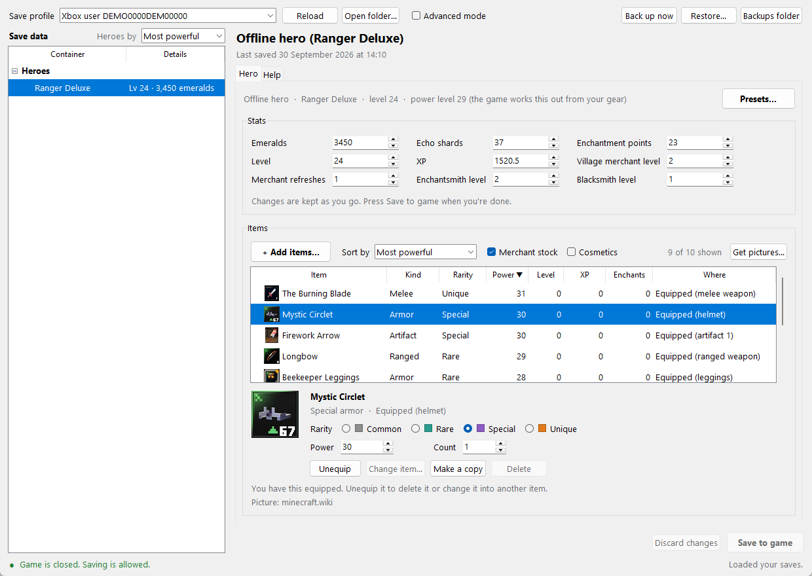
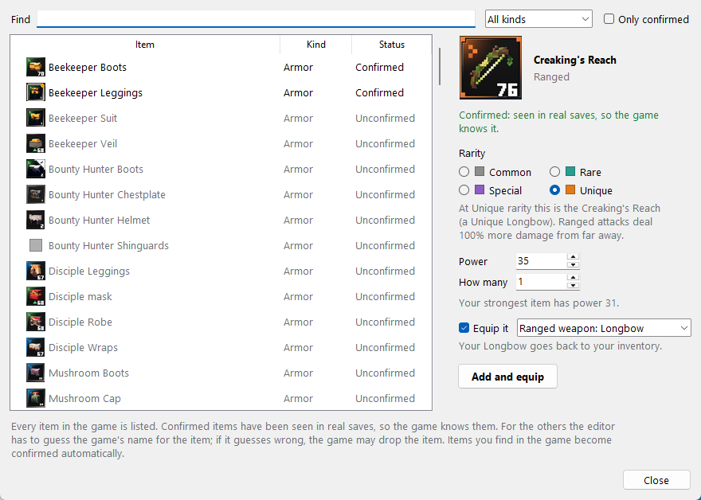
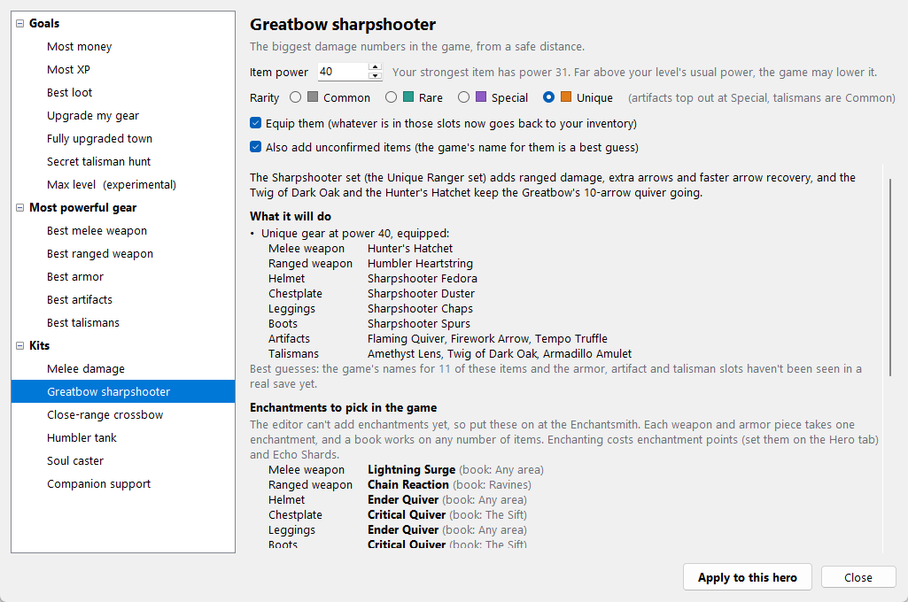
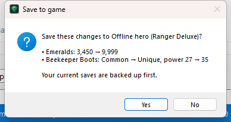
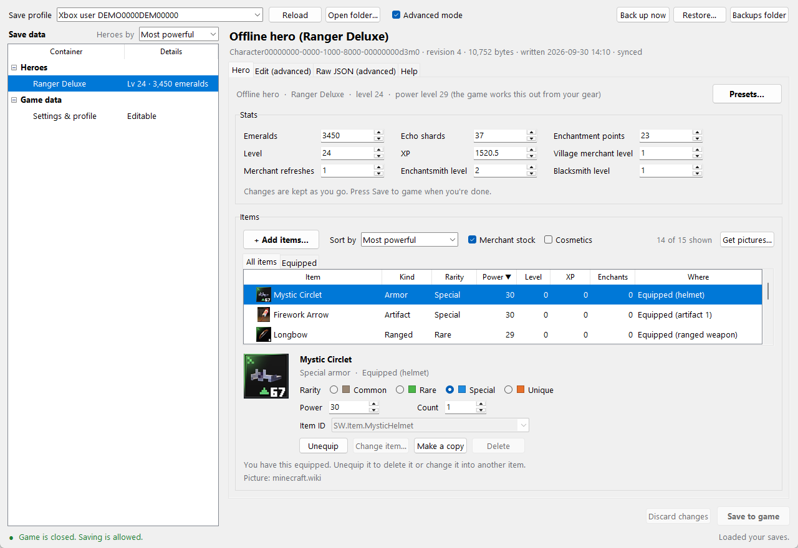

# Minecraft Dungeons II Save Editor

An unofficial save editor for **Minecraft Dungeons II** on Windows (Xbox app / PC Game Pass). Change your offline
hero's stats and gear, add and equip items, apply ready-made presets and complete kits from top builds, and sort
everything by power, XP and more, without having to know anything about save files. Advanced mode shows the full
save for people who want it.



## Features

- **Stats:** emeralds, Echo Shards, level, XP, enchantment points, and the Merchant, Enchantsmith and Blacksmith
  levels. Changes apply as you type, and mistakes show up in red next to the field.
- **Items:** change rarity, power and count, equip or unequip, turn an item into another one, make copies or
  delete them.
- **Add items:** pick any of the game's 181 weapons, armor pieces, artifacts and talismans, with pictures, search
  and a category filter, and tick **Equip it** to put it straight on your hero. All 116 Uniques are there too: pick
  Unique rarity and a War Hammer becomes the Heartbreaker. Items show their in-game names.
- **Presets:**
  - **Goals:** Most money, Most XP, Best loot, Upgrade my gear, Fully upgraded town, Secret talisman hunt and Max
    level.
  - **Most powerful gear:** the best melee weapon, ranged weapon, armor, artifacts and talismans.
  - **Kits:** six complete loadouts from MetaBot's data-backed builds (Melee damage, Greatbow sharpshooter,
    Close-range crossbow, Humbler tank, Soul caster and Companion support).

  Pick the item power and rarity, and the preset adds and equips everything. Each one shows what it will change,
  and lists the best enchantment for every piece, what it does and where its book drops.
- **Sorting:** items by most powerful, highest item level, most item XP, rarest, most enchantments, newest, name,
  kind or location; heroes by power, level, XP or emeralds.
- **Pictures:** item pictures from the Minecraft Wiki, downloaded on request, or your own.
- **Simple and Advanced modes:** Simple keeps numbers within the game's caps and hides the technical parts.
  Advanced adds a tree of every value in the save, the raw JSON, the settings save and raw item IDs.
- **Safe saving:** a backup before every save, one-click restore, no saving while the game runs, a read-back check
  after writing, and an automatic rollback if anything fails.

| Add items | Kits |
|---|---|
|  |  |

| Before saving | Advanced mode |
|---|---|
|  |  |

## Download

**[⬇ Download MCD2SaveEditor.exe](https://github.com/IshiakiZ/mcd2-save-editor/releases/latest)** from the latest
release and double-click it. There's nothing to install, and it finds your saves automatically.

1. **Close the game.**
2. Open **MCD2SaveEditor.exe**.
3. Pick your hero on the left, make your changes, and press **Save to game**.

Windows may say **"Windows protected your PC"** because the .exe isn't code-signed. Click **More info → Run
anyway**. The .exe is built by GitHub Actions straight from this repository's source
([the workflow](.github/workflows/release.yml)). The .exe keeps backups, pictures and settings in
`%LOCALAPPDATA%\MCD2 Save Editor`.

**Running from source instead:** install [Python 3.10 or newer](https://www.python.org/downloads/) (its standard
installer includes the Tkinter this uses), download this repository (**Code → Download ZIP**), unzip it and
double-click **Start Save Editor.bat**. Run that way, backups, pictures and settings stay in the unzipped folder.

**Try a small change first** (a few emeralds, say), start the game and check it before making big ones. Every
save first copies your whole save folder into `backups\`, and **Restore…** puts any of those back. Backups contain
your sign-in token, so don't share them.

## What it can't do

- **Online heroes** are stored on the game's servers, so no save editor can change them. When you create a hero,
  the game makes you pick online or offline for good; this editor works with **offline** heroes.
- **Some added items may not work yet.** A save stores each item under an internal name (the Mystic Circlet is
  `SW.Item.MysticHelmet`). The game's list of those names is in encrypted files, so for most items the editor works
  it out from the in-game name, following the pattern of the names seen in real saves. Items whose internal name has
  been seen in a real save are marked **Confirmed**; the rest are **Unconfirmed**, and if a guess is wrong the game may
  drop the item. The editor asks before adding an unconfirmed item, and Restore… undoes it. Items you find in the
  game become confirmed automatically. Found a wrong or missing one? `python -m dungeons2_editor items` lists them
  all, so please open an issue with the correct name from your save (Advanced mode shows it).
- **Equipping armor, artifacts and talismans is a best guess.** A save names each equipment slot, and only the
  weapon slots have been seen in a real save so far. The editor guesses the others from them and learns the real
  names as soon as a save shows one, so equip one of each in the game first if you can.
- **Enchantments and Unique signature effects** can't be added yet. Presets tell you which enchantments to put on
  at the Enchantsmith instead.
- Only the **Xbox app / PC Game Pass** version is supported; the Steam version keeps its saves differently.
- Level, XP, item power caps and some other numbers come from community datamines, not from the game's own tables.
  The **Max level** preset is experimental.

## How it works

The game stores saves in the Xbox app's standard layout under
`%LOCALAPPDATA%\Packages\Microsoft.MinecraftDungeons2_8wekyb3d8bbwe\SystemAppData\wgs\`: `containers.index`
lists named containers, each container folder has a `container.<N>` file naming its data blob, and the blobs hold
the data.

- **Heroes** (`Character<id>`) are plain, compact JSON. Stats are in `Ability.Attributes`, items in
  `Inventory.Entries`.
- **Settings** (`GlobalSaveDataDefault`) are JSON with every byte stored minus one (`{"blobs"` becomes `z!aknar!`).
- The editor writes both formats byte-for-byte the way the game does, so an unedited save comes out identical.
- Saves are written the way the game writes them: the new data gets a new file name, the revision goes up
  (`container.<N+1>`), and the container is marked modified so Gaming Services uploads it to the Xbox cloud. Only
  then is the old revision deleted.
- Sign-in, entitlement and device-ID containers are never read or changed.

## Command line

```
python -m dungeons2_editor list                                 # show containers
python -m dungeons2_editor export GlobalSaveDataDefault out.json
python -m dungeons2_editor import GlobalSaveDataDefault out.json # asks first, backs up first
python -m dungeons2_editor backup
python -m dungeons2_editor restore "backups\2026-09-30_14-35-12"
python -m dungeons2_editor verify                               # checks saves re-encode exactly; writes nothing
python -m dungeons2_editor pictures                             # download item pictures from minecraft.wiki
python -m dungeons2_editor items                                # every item the editor can add, with its ID
```

Add `--profile <folder>` to point at a save folder somewhere else.

## Research: the fastest way to gear, XP and emeralds

[**mcd2-research**](mcd2-research/README.md) is a separate write-up of what the game's readable files and
community datamines say about loot odds, the route to level 42, secret talisman locations, currency caps, Soul
Storms and the fastest progression. The editor's presets are built from it.

## Development

```
python -m unittest discover -s tests -t .
```

| Path | What's in it |
|---|---|
| `dungeons2_editor/wgs.py` | Xbox save containers: reading, and writing new revisions |
| `dungeons2_editor/codec.py` | The two JSON formats, reproduced exactly |
| `dungeons2_editor/saves.py` | Finding saves, backups, restore, safe saving |
| `dungeons2_editor/hero.py` | Hero stats and items, the add-item catalog, change summaries |
| `dungeons2_editor/presets.py` | The presets, kits and the facts behind them |
| `dungeons2_editor/data/` | The item and enchantment lists (`tools/build_item_catalog.py` rebuilds them) |
| `dungeons2_editor/gui.py`, `hero_tab.py`, `item_picker.py`, `presets_dialog.py`, `layout.py` | The window |
| `dungeons2_editor/icons.py`, `wiki.py` | Pictures and the Minecraft Wiki downloader |

## Credits and disclaimer

This is a fan project. It is **not affiliated with or endorsed by Mojang Studios or Microsoft**. Minecraft is a
trademark of Mojang Synergies AB. Use it at your own risk and keep your backups.

- Item names, armor sets and slots, Unique versions and what they do, and the enchantments come from
  [MetaBot.GG](https://metabot.gg/en/minecraft-dungeons-2)'s database, which is built from the game files:
  [Unique items](https://metabot.gg/en/minecraft-dungeons-2/uniques),
  [artifacts](https://metabot.gg/en/minecraft-dungeons-2/artifacts),
  [talismans](https://metabot.gg/en/minecraft-dungeons-2/talismans) and
  [enchantments](https://metabot.gg/en/minecraft-dungeons-2/enchantments). `tools/build_item_catalog.py` rebuilds the
  lists from those pages.
- The best gear, the kits and the numbers in the presets come from MetaBot.GG's
  [best builds guide](https://metabot.gg/en/minecraft-dungeons-2/guides/best-builds),
  [tier list](https://metabot.gg/en/minecraft-dungeons-2/tier-list) and other guides; each preset links its pages.
- Item pictures come from the [Minecraft Wiki](https://minecraft.wiki) and are downloaded on your PC when you ask;
  none are included here. The screenshots use a made-up demo save.
- The Xbox save container layout follows [libNOM.io](https://github.com/zencq/libNOM.io), which writes No Man's Sky
  saves the same way.
- Game facts come from community datamines by [MetaBot](https://metabot.gg/en/minecraft-dungeons-2) and
  [Maxroll](https://maxroll.gg/minecraft-dungeons-2); see [mcd2-research](mcd2-research/README.md).

Released under the [MIT License](LICENSE).
