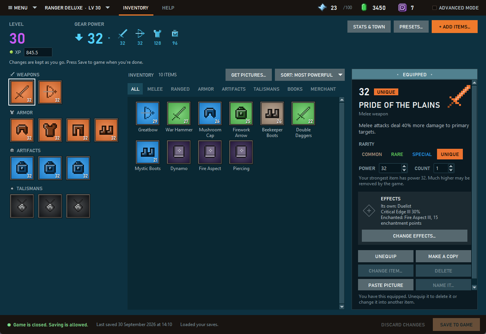

# Minecraft Dungeons II Save Editor

An unofficial save editor for **Minecraft Dungeons II** on PC: the **Xbox app / PC Game Pass** version and the
**Steam** version, on Windows, on Linux (Steam through Proton) and on a Mac (through CrossOver or Whisky). Change your offline hero's stats and gear, add and
equip items, and apply ready-made presets and complete kits from top builds, without having to know anything about
save files. It looks like the game's own inventory screen, so you already know your way around. Advanced mode shows
the full save for people who want it.



> **Also from the same developer:** [**Lemma**](https://lemma.ishiakiz.com), a free creative studio for Minecraft, and
> [**Batchly**](https://batch-ly.com), free browser games, tools and experiments.

**Questions, ideas and builds** go in [Discussions](https://github.com/IshiakiZ/mcd2-save-editor/discussions); bugs, and the
lists of item IDs the editor makes for you, in [Issues](https://github.com/IshiakiZ/mcd2-save-editor/issues).

## Features

- **Looks like the game:** your gear on the left (weapons, armor, artifacts, talismans) as tiles in their rarity's
  colour, the rest of your inventory in the middle, and the item card on the right, with level, gear power and your
  currencies along the top, just like the game's inventory screen. Click a tile to change it on its card, double-click
  an empty slot to put something in it, and right-click any tile for its actions.
- **Stats:** emeralds, Echo Shards, level, XP, enchantment points, and the Merchant, Enchantsmith and Blacksmith
  levels (under **Stats & town**). Click a number to change it; changes apply as you type, and mistakes show up in
  red. The editor also tells you which of the three town vendors your hero has unlocked.
- **Items:** change rarity, power and count, equip or unequip, turn an item into another one, make copies or
  delete them. Every gear slot is shown, including the ones your level hasn't opened yet.
- **Effects and enchantments:** give a weapon, armor piece or artifact the effects you pick (the game rolls a Rare
  item one and a Special item two, and never more than four), and a weapon or armor piece an enchantment. The editor
  writes them exactly as a real save holds them, so it offers the ones it has seen so far, plus anything on an item
  in your own saves, which it can copy to any other item. See [what it can't do yet](#what-it-cant-do).
- **Best for:** in the effects window, pick what you want from the item (damage, survival, mobility, loot, artifacts
  and souls, or companions) and the editor puts its picks on, out of the effects the game can roll on that very item.
  A Sword is Fighter gear, so for damage it gets Sharpness, Duelist, Swiftness and Critical Hit; a Ranger's boots
  get Speed for mobility, and a Tank's chestplate is told the game rolls no mobility effect on it. See
  [how it picks](#what-it-cant-do).
- **Talisman levels:** an item's card shows a talisman's level and how far it is from the next one, and **Ready to
  level up** puts it one XP short, so the game levels it up the next time you earn XP with it on.
- **Add items:** pick any of the game's 180 weapons, armor pieces, artifacts and talismans, with pictures, search
  and a category filter, and tick **Equip it** to put it straight on your hero. All 116 Uniques are there too: pick
  Unique rarity and a Sword is added as The Burning Blade, and kits come with their Uniques. A Unique comes with
  the effect of its own, saved the way the game saves it, for 115 of the 116
  ([the one left](#what-it-cant-do) says so). Items show their in-game names.
- **Presets:**
  - **Goals:** Most money, Most XP, Best loot, Upgrade my gear, Fully upgraded town and Secret talisman hunt.
  - **Most powerful gear:** the best melee weapon, ranged weapon, armor, artifacts and talismans.
  - **Kits:** six complete loadouts from MetaBot's data-backed builds (Melee damage, Greatbow sharpshooter,
    Close-range crossbow, Humbler tank, Soul caster and Companion support).

  Pick the item power and rarity, and the preset adds and equips everything. A kit's gear comes with effects, and
  with enchantments once your hero has unlocked the Enchantsmith in the game, from the ones the editor can write.
  Each preset shows what it will change, and lists the best enchantment for every piece, what it does and where its
  book drops.
- **Let an AI do it:** connect Claude or another AI assistant over MCP, and ask it for what you want ("give my hero
  the best melee kit at power 30"). It shows you its changes before anything is written. See
  [Let an AI customise your hero](#let-an-ai-customise-your-hero-mcp).
- **Sorting and filters:** items by most powerful, highest item level, most item XP, rarest, most effects,
  newest, name or kind, and filters for each kind of item and the Village Merchant's stock; heroes by power, level,
  XP or emeralds.
- **Pictures:** item pictures from the Minecraft Wiki, downloaded on request, or your own. The editor cuts the item
  out of the wiki's pictures so it sits on the game-style tiles; items without a picture get a pixel-art icon. For an
  item the wiki doesn't have, snip its tile in the game (Windows+Shift+S), pick it in the editor and press
  **Paste picture**: the editor cuts the item out and keeps it on your PC.
- **Names you teach it:** when the editor doesn't know what the game calls an item, press **Name it…** on its card.
  The name stays on your PC, and **Share item IDs…** can send it on so everyone gets it. When your saves hold
  item IDs, effects or enchantments the editor's list doesn't have, a **Share item IDs** button with the count
  appears at the top; nothing is sent unless you send it.
- **Simple and Advanced modes:** Simple looks like the game, keeps numbers within the game's caps and opens gear
  slots with your level, as the game does. Advanced is the technical view: every item in a sortable list, a tree of
  every value in the save, the raw JSON, the settings save and raw item IDs.
- **Updates itself:** when a newer version is out, an **Update** button appears. Press it and the editor downloads
  the new version from GitHub, checks it and replaces itself; your saves, backups, pictures and settings aren't
  touched.
- **Safe saving:** a backup before every save, one-click restore, no saving while the game runs, a read-back check
  after writing, and an automatic rollback if anything fails. If the game saves your hero while the editor is open,
  the editor loads the new version, or re-applies your unsaved changes to it, so neither side's progress is lost.
  If a game update has changed how heroes are saved since the editor was last checked, it says so before you save.

| Add items | Kits |
|---|---|
|  |  |


## Download

**[⬇ Download MCD2SaveEditor.zip](https://github.com/IshiakiZ/mcd2-save-editor/releases/latest)** from the latest
release. There's nothing to install, and it finds your saves automatically.

1. Unzip it (right-click → **Extract All…**) and open the **MCD2SaveEditor** folder.
2. **Close the game.**
3. Open **MCD2SaveEditor.exe**. Leave it in its folder: it needs the `_internal` folder next to it.
4. Your hero opens (pick another at the top left), make your changes, and press **Save to game**.

Windows may say **"Windows protected your PC"** because the .exe isn't code-signed. Click **More info → Run
anyway**. The editor keeps backups, pictures and settings in `%LOCALAPPDATA%\MCD2 Save Editor`, not in its own
folder, so a newer version can simply replace the folder. That's what the **Update** button does: when the editor
opens it asks GitHub whether a newer version is out, and the button appears if one is.

**Running from source instead:** install [Python 3.10 or newer](https://www.python.org/downloads/) (its standard
installer includes the Tkinter this uses), download this repository (**Code → Download ZIP**), unzip it and
double-click **Start Save Editor.bat**. Run that way, backups, pictures and settings stay in the unzipped folder.
Install [Pillow](https://pypi.org/project/pillow/) too (`py -m pip install pillow`) for smoother item pictures; the
.exe includes it.

**Steam version:** the editor finds your saves by itself, on Windows
(`%LOCALAPPDATA%\Dungeons2\Saved\SaveGames`) and on Linux inside the game's Proton prefix
(`~/.local/share/Steam/steamapps/compatdata/1912410/pfx/drive_c/users/steamuser/AppData/Local/Dungeons2/Saved/SaveGames`,
also for Flatpak/Snap Steam and games on other Steam library drives). Hero saves are the `Character<id>.sav` files.
If it can't find them, use **Menu → Open a save folder…** or `--profile <folder>`. On Linux, run it from source with
**Start Save Editor.sh** (needs Python 3.10+ with Tkinter: `sudo apt install python3-tk` on Debian/Ubuntu). On a
Mac the game runs through a Windows layer such as CrossOver or Whisky, and the editor looks in their bottles (and in
a plain Wine prefix, `~/.wine`) for the same `SaveGames` folder; run it from source by double-clicking
**Start Save Editor.command** (the first time, right-click it and choose **Open**; it needs Python 3.10+ from
[python.org](https://www.python.org/downloads/macos/), whose installer includes Tkinter). Close the
game, and let Steam finish syncing, before saving.

### Antivirus warnings, and checking the download

The editor is a Python program, packaged for Windows with PyInstaller. Scanners that judge a file by its shape flag
many PyInstaller programs, because malware gets packaged the same way: the 1.4.0 .exe was flagged by 6 of 71 engines
on VirusTotal, all of them generic or machine-learning verdicts. To give them less to trip over, the download is now a
plain folder (the .exe no longer unpacks itself every time it starts), its launcher is compiled during the build
(not PyInstaller's ready-made one, which malware also carries), and the .exe says what it is and which version.
The 1.8.1 download was flagged by none of 66 engines
([its VirusTotal page](https://www.virustotal.com/gui/file/0164cb93bcfe47a60b77015e0722fdf7584c31f54c230220612c5bc89df2e009)).
A scanner can still get a later version wrong, so the checks below stay worth knowing.

You don't have to take anyone's word for what's in the download:

- **Nobody builds it by hand.** GitHub Actions builds every release from this repository's source and attaches it
  ([the workflow](.github/workflows/release.yml)).
- **You can check that.** With the [GitHub CLI](https://cli.github.com),
  `gh attestation verify MCD2SaveEditor.zip --repo IshiakiZ/mcd2-save-editor` confirms the zip you downloaded is the
  one that workflow built, and from which commit. It works on the `MCD2SaveEditor.exe` inside as well.
- **The source is all here.** The editor goes online for three things: when it opens, it asks GitHub whether a
  newer version is out; **Update** downloads that version; and it downloads item pictures from minecraft.wiki when
  you ask. Links open in your browser. Nothing about you or your saves is sent anywhere. The edition built for
  Nexus Mods, which doesn't host programs that go online, does none of the three: everything that would open a
  connection is switched off when it's built (`dungeons2_editor/edition.py`), and the build checks that it refuses.
- **You can skip the .exe** and run it from source, as above.

### Code signing policy

**Status: applied for, not active yet. Releases up to 1.5.0 are not signed.**

Free code signing provided by [SignPath.io](https://about.signpath.io), certificate by
[SignPath Foundation](https://signpath.org).

- Committers and reviewers: [Ishiaki](https://github.com/IshiakiZ)
- Approvers: [Ishiaki](https://github.com/IshiakiZ)

Privacy policy: the editor never sends your saves, your hero's data or anything about you anywhere. It contacts
other computers in three cases only. When its window opens, it asks GitHub (api.github.com) which version is the
latest; that request carries only what any web request does, your IP address and the editor's name and version.
When you press **Update**, it downloads that version from GitHub. When you ask for item pictures, it downloads them
from minecraft.wiki. Links open in your own browser.

**Try a small change first** (a few emeralds, say), start the game and check it before making big ones. Every
save first copies your whole save folder into `backups\`, and **Restore a backup…** (in **Menu**) puts any of those
back: pick one and press Restore. It writes a backup's saves over the ones in your save folder, so it can't bring
back a hero you've since deleted in the game. Backups contain your sign-in token, so don't share them.

> **Versions before 1.2.3 could lose edits and progress.** They wrote save files differently from the game (they
> kept the old cloud ID), so the Xbox app's cloud sync could bring the old data back. Edits then didn't show up in
> the game, and in one case the hero went back to a much older copy. 1.2.3 writes saves the way the game does. The
> game's own cloud save (on by default) can also bring back an older copy of a hero, so check one small change in
> the game before making more.

## Let an AI customise your hero (MCP)

The editor can run as an [MCP](https://modelcontextprotocol.io) server, so AI assistants that support MCP (Claude
Desktop, Claude Code and others) can look at your heroes and change them for you. **Menu → Connect an AI (MCP)…** shows
the exact setup for your PC, with Copy buttons. In short:

- **Claude Desktop:** Settings → Developer → Edit Config, add this, save, and restart Claude Desktop:

  ```json
  {
    "mcpServers": {
      "mcd2-save-editor": { "command": "C:\\path\\to\\MCD2SaveEditor\\MCD2SaveEditor.exe", "args": ["mcp"] }
    }
  }
  ```

- **Claude Code:** `claude mcp add mcd2-save-editor -- "C:\path\to\MCD2SaveEditor\MCD2SaveEditor.exe" mcp`

The assistant gets tools to list your heroes, show a hero's stats, gear and inventory, search every item in the game,
set stats, add, change, equip, copy and delete items, give an item effects and an enchantment, get a talisman ready
to level up, and apply presets. Its changes collect in a draft, like unsaved
changes in the editor window: nothing is written until it calls **save_changes**, which needs the game to be closed
and backs up your saves first, exactly like **Save to game**. It plays by Simple mode's rules (offline heroes only, the
game's caps, slots that open with your level, and best-guess item IDs only if it asks for them), and it never sees
your sign-in, account or device data.

## What it can't do

- **Online heroes** are stored on the game's servers, so no save editor can change them. When you create a hero,
  the game makes you pick online or offline for good; this editor works with **offline** heroes.
- **Item IDs come from real saves.** A save stores each item under an internal name, which often isn't the
  name you see: the Riftslasher is `SW.Item.CurvedLongsword`, the Sculk Digger set is `CaveCrawler` and the Amethyst
  Lens is `SW.Item.Talisman.RangedBuff`. The game's list of those names is in its encrypted content files, and the
  editor doesn't break that encryption, so it knows the names players have reported from their saves (all 180
  items by now) and would work any other out from the in-game name. (The equipment slots are different: the game's
  readable script cache names all 12, so equipping is exact.) In testing, the game removed items whose name was a
  wrong guess and kept the rest of the hero. Items whose internal name has been seen in a real save are marked
  **Confirmed**; the rest are **Unconfirmed**, and if a guess is wrong the game may drop the item. The editor asks
  before adding an unconfirmed item, and Restore… undoes it. Items you find in the game become confirmed
  automatically, and so does an item you added under a guess once the game has kept it. An ID only counts as seen
  when the game itself vouches for it: it's in the game's collections, in the Village Merchant's stock, or on an
  item the game has shown you. What the editor wrote doesn't count, or its own guesses would come back looking
  confirmed. To help everyone else, press **Share item IDs…** on the Help page (or run
  `python -m dungeons2_editor ids`): it lists the IDs in your saves that the editor doesn't know yet and opens a
  GitHub issue with just those IDs and the effects saved with your items (see below), nothing else from your save.
- **Most Uniques go by a pattern.** A Unique is saved under an ID of its own: The Burning Blade, the Unique Sword, is
  `SW.Item.Sword_Unique1`, and the Oracle Tights are `SW.Item.MysticLeggings_Unique`. Of the 116, 115 have been
  seen in real saves, and every one is its base item's ID with `_Unique1` (weapons) or `_Unique` (armor) on the end.
  So the editor adds the one that's left (the Packleader Muzzle) under the ID that pattern gives, and says so. If one were wrong,
  the game would drop that item and keep the rest. Making an item you already own Unique is stricter: it only turns
  into its Unique when that ID has been seen; otherwise it keeps its name and just gets Unique rarity, because a
  wrong ID would cost you the item.
- **A talisman is added with what it does.** A talisman has no rarity or power. A save holds what it does at
  each of its three levels instead: for the Sigil of Beeswax that's `SW.Effect.HealthBoost` at 1.2, 1.25 and 1.35,
  and for a companion's talisman like the Tasty Bone, a tag at each level. Players have shared this for all 24
  talismans, so the editor adds each the way the game saves it. (One oddity it keeps: the game spells the Wonderful
  Wheat's ID with a small "sw", `sw.Item.Talisman.Llama`.) A talisman added by a version before 1.7.1, or by a
  later one that didn't know it yet, has no effect saved and may do nothing in the game; the editor points those
  out, and you can delete them and add them again.
- **A talisman's level is the game's to change.** The editor sets the XP a talisman has earned and leaves the
  levelling up to the game: **Ready to level up** puts it one XP short of the next level (18,480 XP for level 2
  and 73,920 more for level 3), and the next XP you earn with it equipped does the rest.
- **Effects and enchantments: only the ones seen in a save.** The game keeps its list of effects in its encrypted
  files, so the editor learns how each one is saved from real saves: 60 gear effects and 18 enchantments so far
  (Ancient Alchemy at every tier; Healing Smite and Piercing at tiers I and III; Ender Quiver at II and III;
  Somersault at II; Health Synergy at I; and at tier III Chain Reaction, Thundering, Fire Aspect, Gravity Pulse,
  Springload, Swirling, Barrier Brew, Artifact Amplifier, Cow Stampede and three the save calls Blowback, Borealis
  and Lingering Power), plus whatever is on your own items. The editor knows what the game calls all 60 effects, and the
  game's own numbers for them are published (MetaBot's table), so it also offers the tiers nobody has sent yet; it
  marks those as not seen and asks before adding one. An enchantment's saved strength isn't
  the number the game shows, so each tier of each enchantment has to be seen once: enchant one item with it in the
  game and the editor can put it on any other, and **Share item IDs…** sends it on for everyone. The effects the
  game rolls and the enchantment are what you can change. Nobody has tried every effect on every kind of item, so
  check the result in the game.
- **Best for is a recommendation, not a measurement.** Which effects an item can get is the game's rule: it
  rolls them from the pool of the item's slot (any weapon, any artifact, all gear) and from one pool for each
  archetype the item carries (a Greatbow is Fighter and Ranger gear). MetaBot lists every item's archetypes and
  every effect's pools, and players' lists bear it out: of the 342 effects the game rolled on the items in them,
  338 are in the pool this predicts, and the other four are on items their owner had changed with the editor.
  All nine effects on the next drops in the developer's own game were in their item's pool too.
  Which of an item's effects serve a goal best is the editor's own judgement, from what the game says each effect
  does: a bonus that always applies comes before one that needs a critical hit or a charged shot, and that before
  one that needs the right enemy or moment. Nobody has measured one effect against another. A pick is at the best
  tier a real save has shown, and an effect that boosts one element's attacks is only picked when your hero has an
  artifact of that element equipped. No effect on gear gives XP: The Eye of Experience talisman does (Presets,
  Most XP). You can still add any effect to any item by hand; the window says when the game wouldn't roll it there.
  The game keeps such an effect (The Close Ranger wore a Ranger's Marksman through eleven of the game's own saves);
  whether it does anything there hasn't been tested.
- **A Unique's own effect: 115 of the 116.** In the game a Unique has an effect of its own, the one its card
  describes (the Prime Enchanter's Gauntlets' waves of lightning and ice, say). The game saves it on the item, apart
  from the effects it rolls, and the editor writes it exactly as a real save holds it: for the 96 Uniques that
  players' lists showed it on, and for 19 more that the game's files describe in the very same words as one of
  those (the Slaymore and the Humbler Greaves both deal 50% more damage to secondary targets, and wherever two
  such Uniques have both been seen, they are saved alike: later lists held eight Uniques the editor had worked
  out that way, each saved exactly as it wrote them). Rebuilt with the editor, all 180 items on three players'
  lists came out the same as the game's own, key for key. And it works in the game: the Prime Enchanter's
  Gauntlets, added with the editor, came with their effect in play. The editor works none of these out by rule (a few are
  enchantments under another name, and the game spells two of them its own way), so the one Unique nobody has
  sent, the Packleader Paws, is added without its own effect: the editor says so before you add it, and on its
  card. A Unique made by an older version is without its own effect too; its card
  has a button, **Add its own effect**. **Share item IDs…** lists the own effect of any Unique of yours that the
  editor has none for, or would write differently. (One it writes the same way proves nothing, since the Unique
  may be one you made with the editor.)
- **The Mac is newer still.** The editor finds saves in CrossOver's and Whisky's bottles and can tell when the game
  is running there. The tests of everything but the window pass on GitHub's Macs; the window's own tests can't run
  there yet (the window comes up, but the tests wait for Tk to go quiet and on a Mac it doesn't), and nobody has
  yet told the developer how it goes on a real one. Try a small change first, and say how it went. If your saves are somewhere else, **Menu → Open a save
  folder…** takes any `SaveGames` folder.
- **Steam support is new.** Players of the Steam version wrote it and tested it on a real offline hero (on Linux
  with Proton): loading, editing, saving and restoring. The developer plays the Xbox app version, so try a small
  change first and [report](https://github.com/IshiakiZ/mcd2-save-editor/issues) anything odd. If your Steam saves
  are the Unreal Engine binary kind (they start with `GVAS`) instead of JSON, they show up as read-only. Steam
  Cloud, if on, uploads the edited file when the game closes.
- **If you're asked which save to keep.** After an edit, the game, the Xbox app or Steam may ask whether to keep the
  cloud's save or this PC's. Keep this PC's: that's the one with your changes.
- **Very high power or level may be undone.** In testing, a Unique Sword, a Heavy Crossbow at power 10 and level 10
  all stuck, but in a save with level 100 and twelve items at power 135 the game put the level back to 1 and
  removed the items. Most of those twelve had guessed IDs, so it's not yet clear which part it rejected; stay
  close to your level to be safe.
- Item power caps and some other numbers come from community datamines, not from the game's own tables.

## How it works

**Steam version:** each save is its own file, `Character<id>.sav` for a hero, in the `SaveGames` folder above. The
content is the same plain JSON the Xbox build keeps in a blob, so the same codec reads it. The editor replaces the
file in one step (write a temporary file, then swap it in), and numbers the game writes in an unusual form are
written back exactly as they were, so an unedited save comes out byte for byte identical.

**Xbox app version:** the game stores saves in the Xbox app's standard layout under
`%LOCALAPPDATA%\Packages\Microsoft.MinecraftDungeons2_8wekyb3d8bbwe\SystemAppData\wgs\`: `containers.index`
lists named containers, each container folder has a `container.<N>` file naming its data blob, and the blobs hold
the data.

- **Heroes** (`Character<id>`) are plain, compact JSON. Stats are in `Ability.Attributes`, items in
  `Inventory.Entries`.
- An item's effects are saved in batches, one for each kind, in this order: the one a Unique comes with
  (`SW.Item.Effect.Static`), the ones the game rolled for it (`SW.Item.Effect.Rerollable`) and its enchantment
  (`SW.Item.Effect.Enchantment`); a talisman has its own instead (`SW.Item.Effect.Upgradable`). Each effect holds
  what it is (`SW.Effect.CriticalEdge`), its strength, and the template it was made from, which says the tier
  (`SW.EffectTemplate.CriticalEdge.II`, or `SW.EffectTemplate.Duelist.Unique` for the Pride of the Plains' own).
- **Settings** (`GlobalSaveDataDefault`) are JSON with every byte stored minus one (`{"blobs"` becomes `z!aknar!`).
- The editor writes both formats byte-for-byte the way the game does, so an unedited save comes out identical.
- Saves are written the way the game writes them: the new data gets a new file name, the revision goes up
  (`container.<N+1>`), and the container is marked modified so Gaming Services uploads it to the Xbox cloud. Only
  then is the old revision deleted.
- Sign-in, entitlement and device-ID containers are never read or changed.

## Command line

```
python -m dungeons2_editor list                                 # show containers
python -m dungeons2_editor export GlobalSaveDataDefault out.json
python -m dungeons2_editor import GlobalSaveDataDefault out.json # asks first, backs up first
python -m dungeons2_editor backup
python -m dungeons2_editor restore "backups\2026-09-30_14-35-12"
python -m dungeons2_editor verify                               # checks saves re-encode exactly; writes nothing
python -m dungeons2_editor pictures                             # download item pictures from minecraft.wiki
python -m dungeons2_editor items                                # every item the editor can add, with its ID
python -m dungeons2_editor ids                                  # item IDs in your saves the editor doesn't know yet
python -m dungeons2_editor mcp                                  # run as an MCP server for an AI assistant (stdin/stdout)
python -m dungeons2_editor update                               # look for a newer version on GitHub and install it
```

Add `--profile <folder>` to point at a save folder somewhere else (the Xbox folder with `containers.index`, or the
Steam `SaveGames` folder).

## Research: the fastest way to gear, XP and emeralds

[**mcd2-research**](mcd2-research/README.md) is a separate write-up of what the game's readable files and
community datamines say about loot odds, the route to level 42, secret talisman locations, currency caps, Soul
Storms and the fastest progression. The editor's presets are built from it.

## Development

```
python -m unittest discover -s tests -t .
```

The tests run on every push and pull request, on Windows, on Linux and on a Mac (`.github/workflows/tests.yml`).

| Path | What's in it |
|---|---|
| `dungeons2_editor/wgs.py` | Xbox save containers: reading, and writing new revisions |
| `dungeons2_editor/steam.py` | Steam saves (loose `.sav` files): finding the folders, reading, writing |
| `dungeons2_editor/codec.py` | The two JSON formats, reproduced exactly |
| `dungeons2_editor/saves.py` | Finding saves (both layouts), backups, restore, safe saving |
| `dungeons2_editor/hero.py` | Hero stats and items, the add-item catalog, change summaries |
| `dungeons2_editor/presets.py` | The presets, kits and the facts behind them |
| `dungeons2_editor/data/` | The item, enchantment and effect lists (`tools/build_item_catalog.py` rebuilds them) |
| `dungeons2_editor/gui.py`, `item_picker.py`, `presets_dialog.py`, `restore_dialog.py`, `layout.py` | The window, its dialogs, and sizing them for the display's scaling |
| `dungeons2_editor/inventory_screen.py`, `game_style.py`, `game_art.py` | Simple mode's game-style screen, its colours and theme, and its pixel art |
| `dungeons2_editor/hero_tab.py`, `hero_editing.py` | Advanced mode's Hero tab, and the editing both modes share |
| `dungeons2_editor/icons.py`, `wiki.py`, `my_items.py` | Pictures (and cutting items out of them), the Minecraft Wiki downloader, and the names you give items |
| `dungeons2_editor/mcp_server.py`, `ai_dialog.py` | The MCP server for AI assistants, and the window that shows how to connect one |
| `dungeons2_editor/updater.py` | Finding a newer version on GitHub, and replacing the packaged editor with it |
| `dungeons2_editor/edition.py` | Which edition this is: the one on GitHub, or the one for Nexus Mods that never goes online (`tools/make_edition.py` switches) |
| `dungeons2_editor/effects_dialog.py` | The window that changes an item's effects and enchantment |
| `dungeons2_editor/recommend.py` | "Best for": the editor's picks of effects for a goal, out of the ones the game can roll on an item |
| `tools/` | The item catalog builder, and the release build's helpers and checks |

## Credits and disclaimer

This is a fan project. It is **not affiliated with or endorsed by Mojang Studios or Microsoft**. Minecraft is a
trademark of Mojang Synergies AB. Use it at your own risk and keep your backups.

- Steam support, on Windows and on Linux with Proton, was written and tested by
  [icicle1133](https://github.com/icicle1133) ([#1](https://github.com/IshiakiZ/mcd2-save-editor/pull/1)); keeping the
  Steam build's sign-in files unread comes from [douglas-93](https://github.com/douglas-93)'s Steam support
  ([#5](https://github.com/IshiakiZ/mcd2-save-editor/pull/5)).
- Most of the item IDs marked Confirmed come from lists that [icicle1133](https://github.com/icicle1133)
  ([#2](https://github.com/IshiakiZ/mcd2-save-editor/issues/2)),
  [MEGASLAVMAN](https://github.com/MEGASLAVMAN) ([#7](https://github.com/IshiakiZ/mcd2-save-editor/issues/7)),
  [WyattDrako](https://github.com/WyattDrako) ([#9](https://github.com/IshiakiZ/mcd2-save-editor/issues/9)),
  [Blake5256](https://github.com/Blake5256) ([#11](https://github.com/IshiakiZ/mcd2-save-editor/issues/11),
  [#12](https://github.com/IshiakiZ/mcd2-save-editor/issues/12)) and
  [mauricioggizi](https://github.com/mauricioggizi) ([#17](https://github.com/IshiakiZ/mcd2-save-editor/issues/17))
  collected from real saves, and what most talismans do comes from their saves too.
- What a Unique's own effect is, most of the gear effects and most enchantment tiers come from three lists:
  [darklynkttv](https://github.com/darklynkttv)'s, from a first playthrough
  ([#20](https://github.com/IshiakiZ/mcd2-save-editor/issues/20)), with sixty Uniques the game made;
  [Blake5256](https://github.com/Blake5256)'s ([#21](https://github.com/IshiakiZ/mcd2-save-editor/issues/21),
  [#22](https://github.com/IshiakiZ/mcd2-save-editor/issues/22)), with thirty-one more and twenty-nine other items;
  and [gabrielgm0803-ctrl](https://github.com/gabrielgm0803-ctrl)'s
  ([#23](https://github.com/IshiakiZ/mcd2-save-editor/issues/23)), with twenty-seven Uniques nobody had sent and the
  last three talismans.
  [dtreddy30-source](https://github.com/dtreddy30-source) found that Uniques from the editor were missing it
  ([#19](https://github.com/IshiakiZ/mcd2-save-editor/issues/19)).
- Item names, armor sets and slots, Unique versions and what they do, and the enchantments come from
  [MetaBot.GG](https://metabot.gg/en/minecraft-dungeons-2)'s database, which is built from the game files:
  [Unique items](https://metabot.gg/en/minecraft-dungeons-2/uniques),
  [artifacts](https://metabot.gg/en/minecraft-dungeons-2/artifacts),
  [talismans](https://metabot.gg/en/minecraft-dungeons-2/talismans) and
  [enchantments](https://metabot.gg/en/minecraft-dungeons-2/enchantments). What the game calls a gear effect and its
  number at each tier come from its [gear effects](https://metabot.gg/en/minecraft-dungeons-2/effects) page, what
  each enchantment does and costs from its
  [enchanting guide](https://metabot.gg/en/minecraft-dungeons-2/guides/enchanting-guide), and the XP a talisman
  level takes from its talismans page. How an effect or an enchantment is saved comes from real saves only.
  Each item's archetypes, which decide the effects the game can roll on it, come from its
  [weapons](https://metabot.gg/en/minecraft-dungeons-2/weapons), [armor](https://metabot.gg/en/minecraft-dungeons-2/armor)
  and artifacts pages and the archetypes' pages under [builds](https://metabot.gg/en/minecraft-dungeons-2/builds),
  and an artifact's element from the artifacts page.
  `tools/build_item_catalog.py` rebuilds the lists from those pages.
- The best gear, the kits and the numbers in the presets come from MetaBot.GG's
  [best builds guide](https://metabot.gg/en/minecraft-dungeons-2/guides/best-builds),
  [tier list](https://metabot.gg/en/minecraft-dungeons-2/tier-list) and other guides; each preset links its pages.
- Item pictures come from the [Minecraft Wiki](https://minecraft.wiki) and are downloaded on your PC when you ask;
  none are included here. The screenshots use a made-up demo save.
- Simple mode follows the idea of [MCDSaveEdit](https://github.com/CutFlame/MCDSaveEdit), the save editor for the
  first Minecraft Dungeons, which is laid out like that game's inventory. Its colours and layout follow Minecraft
  Dungeons II's own inventory screen; the fonts are Windows' own and the icons are drawn by the editor.
- The Xbox save container layout follows [libNOM.io](https://github.com/zencq/libNOM.io), which writes No Man's Sky
  saves the same way.
- Game facts come from community datamines by [MetaBot](https://metabot.gg/en/minecraft-dungeons-2) and
  [Maxroll](https://maxroll.gg/minecraft-dungeons-2); see [mcd2-research](mcd2-research/README.md).

Released under the [MIT License](LICENSE): do what you like with it, change it, share your own version or build on
it, as long as the copyright notice, which credits the author, stays with it.
